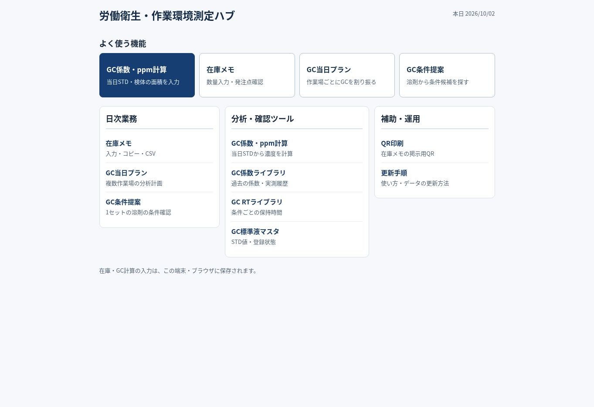

# 現場業務ツール UI/UX 改善・検証記録

対象: https://rodoeisei-lab.github.io/work-ops-hub/

実施日: 2026-10-02。Solが監査・実装・GitHub統合・公開確認、Lunaが独立監査と回帰確認を担当。
最終UIバージョン: `20261002-7`。UI実装コミット: `24a3adc8d6624f7c48c37d35f40c38a7942d9882`。
調査開始時の公開版: `3c61ec17129037684d56621e704de5b1d9999d75`。

## 確認範囲

コード変更前に公開サイトをブラウザで確認した。最終版も実際のブラウザ描画と操作で確認。
ホーム、GC係数・ppm計算、GC係数ライブラリ、在庫メモ、GC当日プラン、GC条件提案、GC RTライブラリ、GC標準液マスタ、QR印刷、更新手順の全10ページを対象とした。
390px・768px・1440pxの表示幅で確認。幅を指定した同一オリジンのiframeを使い、表の領域とページ全体の横幅、入力配置、固定バー、結果表示を確認した。

## 改善前後の評価

| 評価項目 | 改善前の問題 | 最終版と確認結果 |
|---|---|---|
| 1. 主要機能への到達 | 直通リンクの間に長い説明、デザイン宣言、推奨フローが入り、スマホで縦に長い | 主要4機能を上部の2×2または4列へ配置。390pxでも4機能が最初の画面に入り、各機能へ1回のタップで移動 |
| 2. 主操作の識別 | 操作の強弱やリセットの置き場所がページごとに異なる | 計算結果コピー・候補表示・テキスト作成を青で強調。リセットは折りたたみ内へ、削除は赤系の副操作と確認 |
| 3. スマホ入力 | 小さいラベル、密な入力行、小さな削除ボタン、在庫単位の曖昧さ | 入力文字16px、操作領域原則44px以上。GCのSTD/面積、検体結果を整理。在庫単位を入力欄横と読み上げ名へ表示 |
| 4. 表の読みやすさ | 数値の途中改行、幅不足、RTのタブレットでフォームまで横にはみ出す | スマホは既存カード表示を活用。PC/タブレットは数値を改行せず、表の領域内だけ横スクロール。RT 768pxのページ幅753/スクロール幅977を753/753へ修正 |
| 5. ページ間の統一 | 戻るリンク、見出し、補足、ボタンサイズが不統一 | 共通CSS・小型ナビを全ページへ適用。ホームと関連機能への移動、focus表示、読み込み・エラー表示を統一 |
| 6. 誤操作の防止 | リセットや小さい×、負数在庫、古い結果、消せない当日メモ | 削除/リセット確認、数量整数検証、入力変更時の結果無効化、匿名コード検証、時間上限の負数停止、メモごとの削除・保存失敗表示 |
| 7. スクロール量 | 任意入力と説明が主作業に先行、固定バーが最終入力へ重なる | 任意条件を折りたたみ、選択中の条件を見出しへ表示。結果・RT一覧・保存メモへ移動。固定バー1行化と下部余白で最終入力を確保 |
| 8. 既存機能の維持 | UI変更による計算・データ・保存破壊のリスク | GCのcalculate、条件提案rankMethods、当日プランrankは元の関数と完全一致。RT/STD/係数/機械/在庫等のJSONマスタは変更なし。保存復元・コピー・検索等を実操作で確認 |

「3秒以内」は利用者による時間計測試験を行っていない。初期画面で目的の4機能が見え、1操作で移動できる構成を確認した。

## Lunaの指摘とSolの判断

| 指摘 | 採否・対応 | 再確認 |
|---|---|---|
| GC当日プランが実際の候補と異なるGC2014の1台運用を表示 | 採用。候補の機械名で判断・表示し、機械が異なる/不足物質ありの場合は要相談・参考時間を明示 | 単体メタノールは全体・詳細ともGC-14B。複数機械が混在するテストは要相談 |
| 単一物質の最小RT差に999.00minが出る | 採用。評価関数内の既存値は維持し、表示を「—（比較対象なし）」へ | 条件提案・当日プラン双方で確認 |
| 分析時間の目安とグラフのプログラム時間が混同される | 採用。「最終RT＋0.4min」と「登録プログラム時間」を別に説明 | アセトンの目安0.981minとプログラム10minを別表記で確認 |
| 単1電池が発注設定の本数と異なる箱数表記 | 採用。既存設定の本を入力・コピー・CSVへ反映。保存済み数量の確認案内を追加 | 5本の入力、復元、コピー、CSV出力関数を確認 |
| 在庫の固定操作バーが最後の入力に重なる | 採用。バーを1行にし、下部余白と入力位置を調整 | 390/768pxで最終行を確認 |
| RT 768pxでフォームがページ幅を超える | 採用。gridの最小幅を0にし、表のスクロールを領域内へ限定 | Sol・Lunaが修正後753/753と画面を確認 |
| 当日メモを誤保存したときの削除手段がない | 採用。個別削除、確認、状態表示、保存失敗時の既存状態維持を追加 | 保存復元、削除キャンセル、テストメモのみ削除、空状態を双方で確認 |
| 信頼度の対象が曖昧 | 採用。当日プラン詳細を「一致したRTデータの信頼度」へ | 最終表示を確認 |

最終独立監査（20261002-7）で、新たな重大な操作阻害（P1/P2）は報告されなかった。

## 主要操作の検証

| ページ | 実操作と結果 |
|---|---|
| ホーム・共通ナビ | 主要リンク、ホームへ戻る、関連ページ移動、メニュー開閉、Escape、focus表示を確認 |
| GC係数・ppm計算 | 物質/STD選択、15ppm/15491面積/検体322→0.31ppm、同面積→15ppm。検体追加・削除、折りたたみ、負数時の出力停止、確認キャンセル、テストカード削除。再読み込み・コピー内容を確認。元から保存されていたメタノール101.7/100000/50000→50.85ppmを維持 |
| GC係数ライブラリ | CBP→90℃→メタノール、検体面積100000、代表係数0.0131412→参考1314.12ppm。検索1条件→解除26条件。参考値の注意、カード/表/履歴を確認 |
| 在庫メモ | 区分切替、単1電池5本入力・復元・コピー。-1で未保存/出力停止。期限切れテスト2本の追加・検索・コピー・削除確認。検索一致グループ展開、該当なし、解除、固定バー、CSV保存開始を確認 |
| GC当日プラン | 物質未選択、対象物質のある空/重複コード、追加/削除、選択解除、変更後の古い結果の無効化。実機名と要相談の表示を確認 |
| GC条件提案 | 物質追加/解除、任意作業場A01の条件＋溶剤反映、候補表示、RT一覧へ移動、当日メモ保存・復元・削除キャンセル/完了。上限0.1minは時間上限で0件、-1は要確認として候補を停止 |
| RTライブラリ | メタノール＋GC-14B＋SBSで1件、0.568min。該当なし、検索解除、スマホカード、PC/タブレット表を確認 |
| 標準液マスタ | シクロヘキサノン検索で25.5ppm。要確認8件/全37件、検索条件解除、カード/表の数値表示を確認 |
| QR印刷 | 3幅の表示と印刷ボタンを操作。従来のQR風画像を実際のQR SVGへ修正し、生成SVGをデコードして公開在庫メモURLとの一致を確認 |
| 更新手順 | Markdownへの直接リンクをHTMLの読みやすい手順ページへ変更。3幅で描画と共通ナビを確認 |

検証用に作成したカード・数量・期限切れ行・当日メモは整理し、既存の保存データを消去するリセットは実行していない。

## 自動チェック・公開

次の本番関数を使った回帰テストと、全JavaScriptの構文検査を実行し、GitHub Actionsも成功した。

- `scripts/test-gc-calculator.mjs`: 計算、STD未入力/0/負数、複数検体、iOS入力対策、UIガード
- `scripts/test-gc-day-plan.mjs`: 実際の機械名、複数機械、データ不足、作業量
- `scripts/test-inventory.mjs`: 本/箱、0在庫、CSVの引用符エスケープ
- `scripts/test-gc-finder.mjs`: 既存メモの保持、保存失敗時の状態維持、時間上限で候補0件となる説明
- `node --check assets/js/*.js` 相当の全ファイル検査、`git diff --check`

ブラウザーで読んだ336件のerror/warnログではサイト起因のエラーは0件。ブラウザー拡張のmetadata送信エラーをサイトのJavaScriptエラーと分けて確認した。
UI実装コミットのGC calculator checksとGitHub Pages build/deploymentはいずれもsuccess。
検証に使った一時公開ディレクトリ・幅確認ページは最終整理で削除し、公開する業務ツールは1つに統合した。

## 検証の限界

実際のiPhone/Safari・画面キーボード・プリンターでは確認していない。幅指定のChrome実描画での検証であり、WCAG適合認証や現場利用者による時間計測試験ではない。

コピーは実際のクリップボード内容を確認した。CSVはブラウザのボタン操作・保存開始・再ダウンロードリンクと、本番出力関数の内容を検証したが、このクラウドブラウザーではblobのdownload完了イベントがタイムアウトするため、端末のファイル保存完了は確認できていない。画面は「保存しました」と断定せず「保存を開始しました」と表示する。
印刷ボタンは操作したが、実機印刷の仕上がりは未検証。

## 最終公開画面

